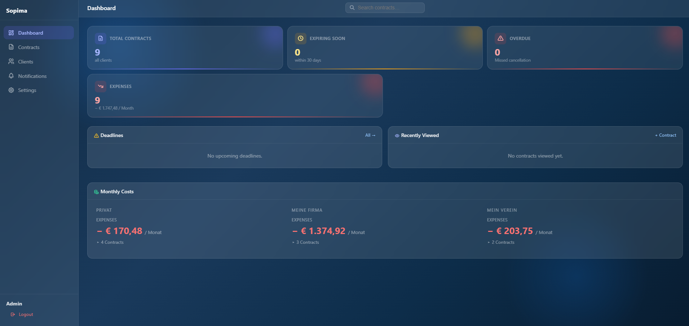
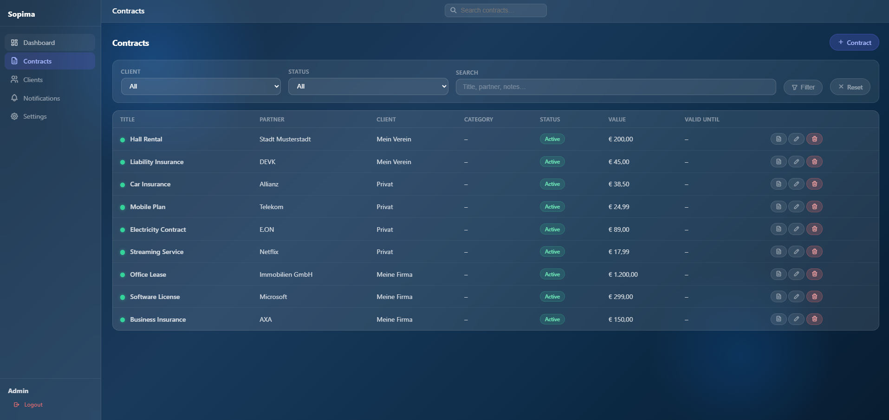

# Sopima

> ⚠️ **Alpha** – Sopima is under active development. Features may change, bugs are possible. Not recommended for production-critical data. Feedback welcome.

> 🇩🇪 [Deutsche Version](README.de.md)

Self-hosted, open-source contract management for individuals, small organizations and teams.

## Screenshots




## Features

- Multi-tenant contract management (CRUD)
- Contract types with type-specific fields (insurance, mobile, loan, misc.)
- Document management with tenant-separated storage
- Communication log per contract
- Full-text search and traffic-light status
- REST API with Bearer token authentication and rate limiting
- Notification system (Email, Discord, Telegram, ntfy, Gotify, Pushover, Webhook)
- Backup/Restore (JSON export/import)
- User management and settings

## Requirements

- PHP 8.2+
- PHP extension: `pdo_sqlite`
- Composer
- Apache with `mod_rewrite`

## Quick Start

Point your Apache VHost DocumentRoot to `public/` and enable `mod_rewrite`.
Then open `https://your-domain.example.com/setup` in your browser.

## Docker

Run `docker compose up -d`, then open `http://localhost:8080/setup`.

## API

See [docs/API.md](docs/API.md) for all endpoints, authentication and rate limiting.

## Notifications (Cron Job)

For bare-metal installations, set up a cron job:

```
0 8 * * * php /path/to/sopima/bin/notify.php >> /var/log/sopima_notify.log 2>&1
```

For Docker, use a separate cron container or a host-level cron job.

## Contributing

See [CONTRIBUTING.md](CONTRIBUTING.md) for details.

## License

MIT
